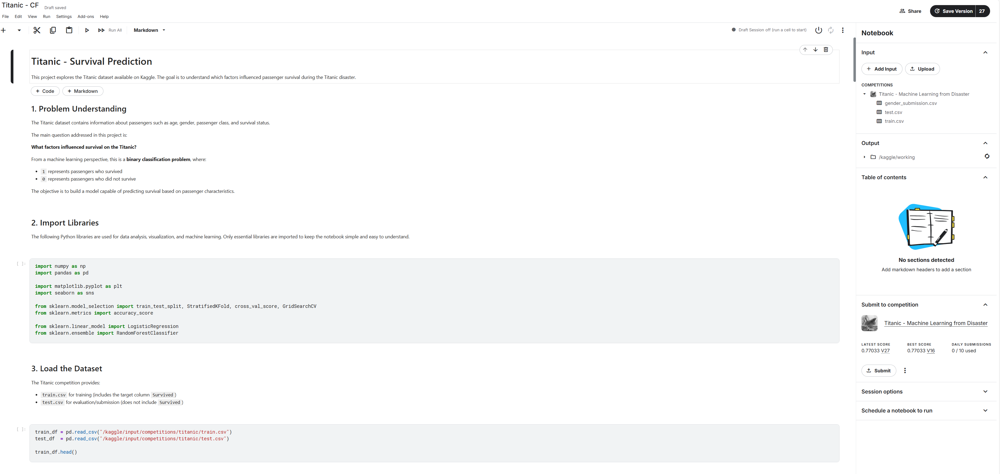
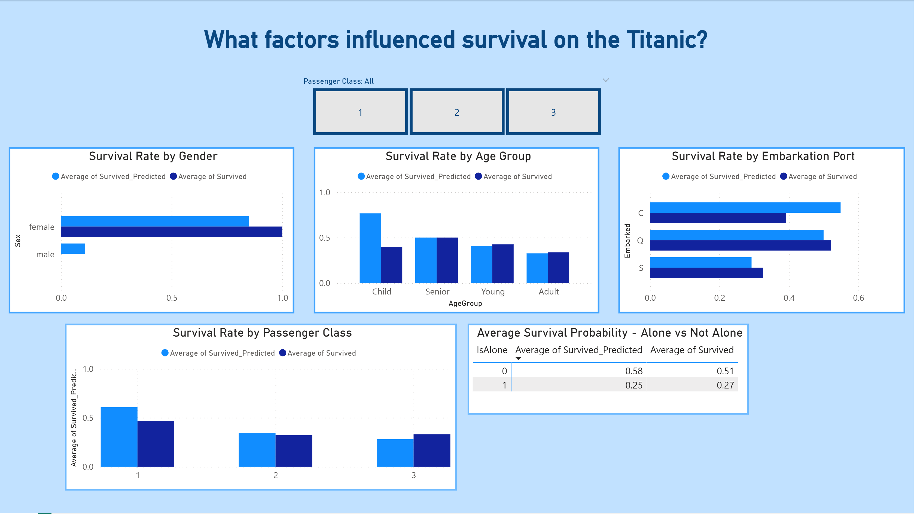
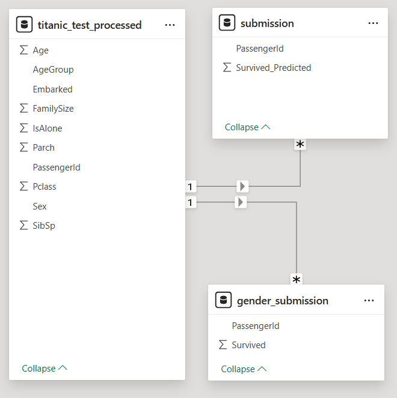

# Titanic Survival Analysis: Machine Learning + Power BI

This repository presents an end-to-end analytics project based on the Titanic dataset. It combines a Python machine learning workflow with a Power BI report to explore survival patterns and evaluate model performance.

## Repository Structure

```text
.
|-- MachineLearning.pbix
|-- titanic-cf.ipynb
|-- data/
|   |-- gender_submission.csv
|   |-- submission.csv
|   |-- titanic_test_processed.csv
|   `-- titanic_train_processed.csv
|-- images/
|   |-- FactorsSurvival.png
|   |-- FactorsSurvivalModel.png
|   `-- TitanicKaggleNotebook.png
`-- README.md
```

## Project Components

### 1. Python Notebook: Titanic Survival Prediction

**File:** `titanic-cf.ipynb`

The notebook includes a full machine learning pipeline to predict passenger survival.

Key tasks:
- Performed exploratory data analysis and data cleaning.
- Created features such as age group, family size, and travel status.
- Encoded categorical variables for model training.
- Trained and evaluated classification models.
- Tuned hyperparameters and compared model results.
- Generated prediction output for Kaggle-style submission.

Notebook preview:


### 2. Power BI Report: Model Results and Survival Insights

**File:** `MachineLearning.pbix`

The Power BI report visualizes prediction outputs and highlights survival trends.

Key tasks:
- Loaded processed datasets and model prediction outputs.
- Built visuals comparing predicted survival vs. actual outcomes.
- Analyzed survival patterns by gender, age group, class, embarkation port, and travel status.
- Added interactive filters to support dynamic analysis.

Report visuals:

**Factors Influencing Survival**  


**Predicted vs. Actual Survival**  


## Tools and Technologies

- Power BI Desktop
- Python (Jupyter Notebook)
- pandas
- numpy
- scikit-learn
- matplotlib
- seaborn

## Author

Cristiana Fonseca
